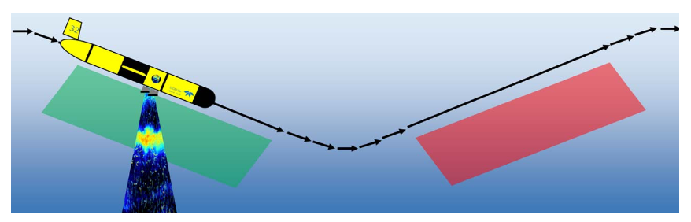

# Glider Acoustics

Some notebooks working on processing the AZFP sensor on a glider. 

(Chave et al 2018, "Adapting Multi-Frequency Echo-sounders for Operation on Autonomous Vehicles"  https://ieeexplore.ieee.org/document/8604815)

Using [`echopype`](https://github.com/OSOceanAcoustics/echopype) as a base to deal with the raw files

Working to integrate glider datastreams for processing

Use bottom and shoal detection algorithms from [`echopy`](https://github.com/open-ocean-sounding/echopy). Must be installed using pip (`pip install echopy`)
